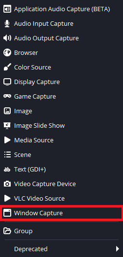

# f1_23_obs_overlay
This python app shows car data that are fetch from the F1® 23 game in a nice UI. 

<p align="center">
  
  <br />
  <i>screenshot of the UI working.</i>
</p>

## Installation
To install all the necessary libraries, you will need to use:
```bash
pip install -r requirements.txt
```

## Library modification 
For this script to work, you will need to modify the `f1-23-telemetry` python library. I know not idea but it is necessary ☹. After installing the library you will need to modify the `listener.py` file. To find the file run this command : 
```bash 
> pip show f1-23-telemetry
Name: f1-23-telemetry
Version: 0.1.4
Summary:
Home-page:
Author: Chris Hannam
Author-email: ch@chrishannam.co.uk
License: MIT
Location: <PATH_To_LIB_FOLDER>\venv\lib\site-packages
Requires:
Required-by:
```

You will find the path to the library in the `Location` field. the `listener.py` file will be inside the `f1-23-telemetry` folder and copy/paste this code. 

```python
"""
Basic listener to read the UDP packet and convert it to a known packet format.
"""

import socket
from typing import Optional

from f1_23_telemetry.packets import PacketHeader, HEADER_FIELD_TO_PACKET_TYPE


class TelemetryListener:
    def __init__(self, host: Optional[str] = None, port: Optional[int] = None, timeout: Optional[int] = None):
        # Set to default port used by the game in telemetry setup.
        if not port:
            port = 20777

        if not host:
            host = '0.0.0.0'

        self.socket = socket.socket(family=socket.AF_INET, type=socket.SOCK_DGRAM)
        self.socket.bind((host, port))

        # Set the listening timeout.
        if timeout is not None: 
            self.socket.settimeout(timeout)

    def get(self):
        try:
            packet = self.socket.recv(2048)
        
        except TimeoutError:
            return None
        
        header = PacketHeader.from_buffer_copy(packet)
        key = (header.packet_format, header.packet_version, header.packet_id)

        return HEADER_FIELD_TO_PACKET_TYPE[key].unpack(packet)
```


## Execution
To start the program execute the `main.py` file. 
- Windows
```bash
python main.py
```


## Tweaks
If you want to use this script without OBS, you can modify the `config.py` file to have a black background. 

```python
# OBS SETTINGS
IS_OBS_OVERLAY = 0
CHROMA_KEY_COLOR = (180, 0, 255)
```
Setting the `IS_OBS_OVERLAY` to 0 will set the background to black whereas setting it to 1 will set it the the color from the `CHROMA_KEY_COLOR` variable. 

## OBS integration
To add this overlay to OBS follow this step by step guide : 

first, run the script, start OBS, and add a `Window Capture` to your scene. 
<p align="center">
  
  <br />
  <i>Window capture position in add source menu. </i>
</p>

Then you will need to capture the window of the script as shown below : 
<p align="center">
  
  <br />
  <i>Window capture settings. </i>
</p>

To remove the magenta background we will add a `Chroma Key` to our window capture. Right Click on the `Window Capture` object and add `filters`. 

<p align="center">
  
  <br />
  <i>Filters position in Right Click menu.  </i>
</p>

Next add a Chroma Key in the bottom left panel. And tweak settings as shown on the image. 
<p align="center">
  
  <br />
  <i>Chroma Key settings. </i>
</p>

And there you go! You got a nice overlay :). 
<p align="center">
  
  <br />
  <i>Game view with the overlay.</i>
</p>


## Licence
- romainflcht